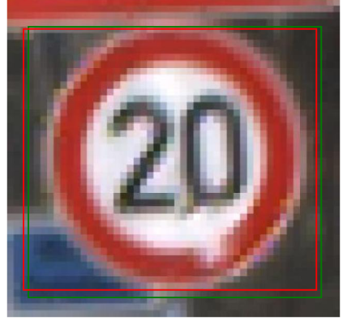

# Custom-Object-Detection
This repository demonstrates the implementation of a custom object detection pipeline using PyTorch. The model predicts bounding boxes and class labels for objects in images, making it a foundational approach to learning object detection techniques.
### Model Architecture
The model consists of:
1. Convolutional Layers: Extract features from input images.
2. Fully Connected Layers: Perform regression to predict bounding box coordinates.
3. Activation Functions: ReLU for non-linearity and max-pooling for down-sampling.
Input images are resized to 640x640 for training and testing.

### Overview
This project involves:
Training a custom model to predict bounding boxes and class labels.
Evaluating the model using metrics Intersection over Union (IoU) and accuracy.
Visualizing predictions to validate the model's performance.

Below is the example of the model's predictions. The green box represent the ground truth, and the red box represent the predicted bounding box.

